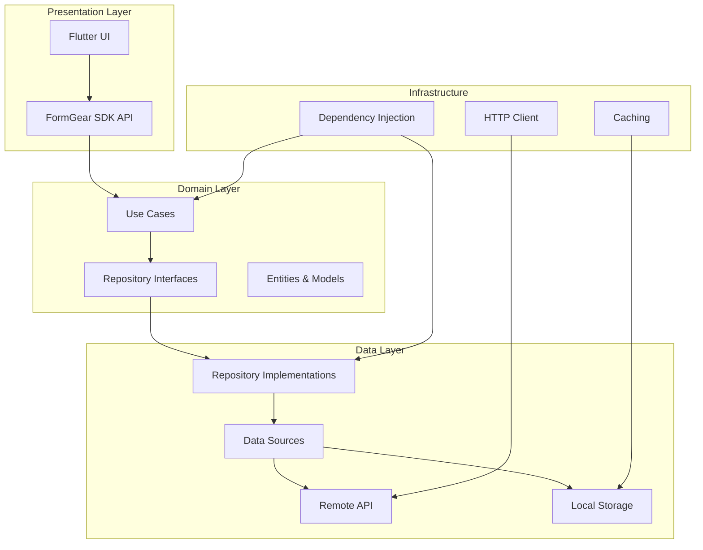
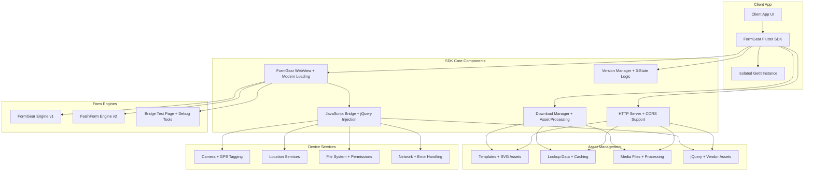
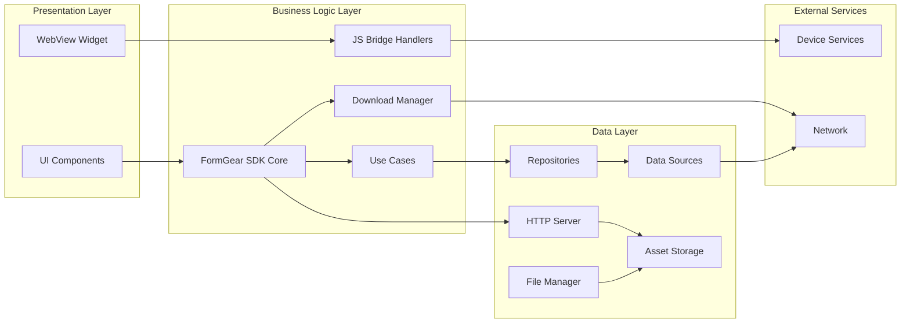
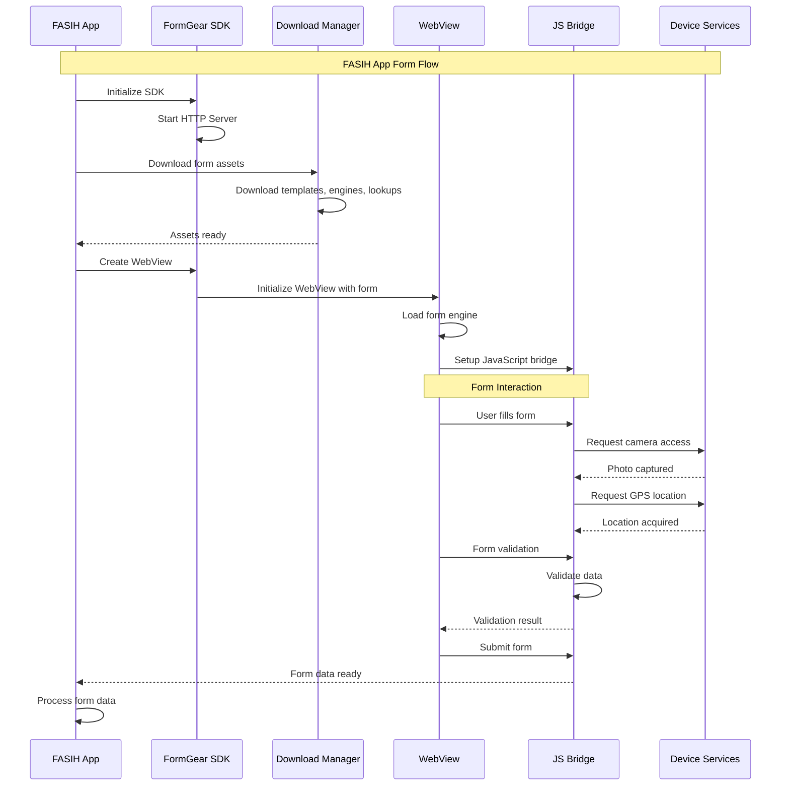

<div align="center">
  

  # FormGear Flutter SDK

  [](https://pub.dev/packages/form_gear_engine_sdk)
  [](https://opensource.org/licenses/MIT)
  [](https://flutter.dev)
</div>

A Flutter SDK for [FormGear](https://github.com/bps-statistics/form-gear) - A flexible, JSON-driven form generation framework for dynamic data collection with 30+ input control types, nested forms, GPS, photo capture, and complex validation capabilities.

Originally developed for BPS - Statistics Indonesia's data collection needs, now available as a Flutter SDK for integration with mobile applications like **FASIH App**.

## Recent Updates

### Version 0.1.0 Latest Improvements

**🎯 Assignment-Based Dynamic Configuration (NEW)**
- Dynamic configuration loading per template/assignment (matches FASIH architecture)
- Global SDK initialization with assignment-specific form configurations
- Template-specific lookup modes (online, offline, local) configurable per assignment
- Assignment-aware JavaScript handlers with context-specific data
- Dynamic engine selection (FormGear vs FasihForm) based on template requirements
- Comprehensive assignment demo showcasing all configuration patterns

**Modern UI/UX Enhancements**
- SVG logo integration replacing PNG throughout SDK and example app
- Animated loading screens with FormGear logo and gradient backgrounds
- Modern rounded progress indicators with smooth animations
- Dynamic theming support that adapts to your app's design

**Technical Improvements**
- Dependency isolation using `GetIt.asNewInstance()` to prevent conflicts with client DI containers
- Automatic jQuery injection for WebView compatibility and bridge test pages
- Enhanced debug tools with bridge test page and status monitoring
- Improved clean architecture demo with better error handling

**Developer Experience**
- Enhanced error handling with user-friendly messages and toast notifications
- Improved HTML processing pipeline with vendor asset injection
- Optimized WebView loading performance with modern animations

## 📋 Table of Contents

- [Features](#features)
- [Architecture](#architecture)
- [Installation](#installation)
- [Quick Start](#quick-start)
- [Assignment-Based Configuration](#assignment-based-configuration)
- [FASIH App Integration](#fasih-app-integration)
- [API Reference](#api-reference)
- [Examples](#examples)
- [Contributing](#contributing)
- [License](#license)

## ✨ Features

### 🔧 Core Features
- **JSON-driven forms**: Define forms using flexible JSON templates
- **30+ input controls**: Text, number, date, dropdown, radio, checkbox, and more
- **Nested forms**: Support for complex hierarchical form structures
- **Dynamic validation**: Real-time form validation with custom rules
- **Assignment-based configuration**: Dynamic per-template configuration (NEW)
- **Offline capability**: Forms work without internet connection
- **File uploads**: Support for image, document, and media uploads
- **Location services**: GPS coordinate capture and location-based features
- **Camera integration**: Photo capture with GPS tagging
- **Signature capture**: Digital signature collection
- **Multi-engine support**: FormGear v1 and FasihForm v2 engines

### 🎯 Assignment-Based Configuration Features (NEW)
- **Global SDK initialization**: Separate global configuration from assignment-specific settings
- **Dynamic lookup modes**: Online, offline, or local data sources per assignment
- **Template-specific configurations**: Different form behaviors per template
- **Assignment context**: Rich metadata and data structures for each assignment
- **Dynamic engine selection**: Automatic FormGear vs FasihForm selection based on template
- **Context-aware handlers**: JavaScript bridge receives assignment-specific data
- **FASIH-compatible architecture**: Matches native Android FASIH patterns

### 📱 Mobile Features
- **WebView integration**: Seamless web-to-native bridge
- **Local HTTP server**: Serves form assets locally for optimal performance
- **Asset management**: Download and cache form templates and lookup data
- **Progress tracking**: Real-time download and form completion progress
- **Error handling**: Comprehensive error management and recovery

### Modern UI & UX Features
- Modern loading screens with FormGear SVG logo and animations
- Consistent branding with SVG logos and dynamic theming support
- Rounded progress bars with smooth animations
- Toast notifications and user-friendly error messages

### Developer Experience
- Clean architecture with dependency injection and clean code patterns
- Isolated dependencies using `GetIt.asNewInstance()` to prevent client app conflicts
- Type-safe APIs with comprehensive Dart experience
- Enhanced error handling with user-friendly feedback
- Automatic jQuery injection for WebView compatibility
- Debug tools including bridge test page with status monitoring
- Extensive logging for development and production
- Seamless web-to-native communication
- Flexible configuration for different use cases

## 🏗️ Architecture

### Clean Architecture Implementation

FormGear SDK follows clean architecture principles for maintainable, testable, and scalable code:



### System Architecture



### Clean Architecture Benefits

#### Separation of Concerns
- **Use Cases**: Encapsulate business logic (e.g., `CheckFormEngineVersionUseCase`)
- **Repository Pattern**: Abstract data access with interfaces and implementations
- **Data Sources**: Handle API calls and local storage separately

#### Type-Safe Error Handling
```dart
// Result pattern for type-safe operations
Result<FormEngineResponse> result = await checkFormEngineVersionUseCase();
result.fold(
  (error) => handleError(error),
  (response) => processSuccess(response),
);
```

#### Dependency Injection
- Automatic registration with `@LazySingleton` and `@Injectable`
- Easy testing with mock implementations
- Loose coupling between layers

#### Testability
```dart
// Easy to mock for testing
final mockRepository = MockFormEngineRepository();
final useCase = CheckFormEngineVersionUseCase(mockRepository);
```

### Component Architecture



## 🚀 Installation

Add this to your package's `pubspec.yaml` file:

```yaml
dependencies:
  form_gear_engine_sdk: ^0.1.0
  flutter_svg: ^2.0.16  # For SVG logo support
```

Then run:

```bash
flutter pub get
```

### Platform Configuration

#### Android

Add to `android/app/src/main/AndroidManifest.xml`:

```xml
<!-- Internet permission for HTTP server and downloads -->
<uses-permission android:name="android.permission.INTERNET" />

<!-- File access permissions -->
<uses-permission android:name="android.permission.READ_EXTERNAL_STORAGE" />
<uses-permission android:name="android.permission.WRITE_EXTERNAL_STORAGE" />

<!-- Camera and location permissions -->
<uses-permission android:name="android.permission.CAMERA" />
<uses-permission android:name="android.permission.ACCESS_FINE_LOCATION" />
<uses-permission android:name="android.permission.ACCESS_COARSE_LOCATION" />
```

#### iOS

Add to `ios/Runner/Info.plist`:

```xml
<key>NSCameraUsageDescription</key>
<string>This app needs camera access to capture photos for forms</string>

<key>NSLocationWhenInUseUsageDescription</key>
<string>This app needs location access to capture GPS coordinates</string>

<key>NSPhotoLibraryUsageDescription</key>
<string>This app needs photo library access to select images</string>
```

## 🚀 Quick Start

### 1. Assignment-Based Configuration (NEW - Recommended for FASIH)

```dart
import 'package:form_gear_engine_sdk/form_gear_engine_sdk.dart';

void main() async {
  WidgetsFlutterBinding.ensureInitialized();

  // 1. Initialize global configuration (API endpoints, authentication)
  final apiConfig = FormGearApiConfig(
    baseUrl: 'https://fasih-api.bps.go.id',
    templateZipEndpoint: '/mobile/assignment-sync/api/mobile/template/zip/{templateId}',
    templateEndpoint: '/mobile/assignment-sync/api/mobile/template/custom-data/{templateId}',
    formEngineEndpoint: '/mobile/notification-service/api/mobile/check-form-engine-release',
    lookupEndpoint: '/api/lookup/{surveyId}',
    authToken: 'your-auth-token',
  );

  final globalConfig = FormGearGlobalConfig.fasih(
    apiConfig: apiConfig,
    bpsUser: BpsUser(
      nipBaru: '123456789',
      jabatan: 'ENUMERATOR',
      org: 'BPS Jawa Barat',
    ),
    username: 'demo_user',
    enableDebugMode: true,
  );

  // Initialize SDK with global configuration
  await FormGearSDK.instance.initializeGlobal(globalConfig);

  runApp(MyApp());
}

// 2. Open forms with assignment-specific configuration
class AssignmentFormPage extends StatelessWidget {
  @override
  Widget build(BuildContext context) {
    return Scaffold(
      appBar: AppBar(title: Text('Assignment Form')),
      body: Column(
        children: [
          // New assignment with empty data
          ElevatedButton(
            onPressed: () => _openNewAssignment(context),
            child: Text('New Assignment (Online Lookup)'),
          ),

          // Existing assignment with response data
          ElevatedButton(
            onPressed: () => _openExistingAssignment(context),
            child: Text('Existing Assignment (Offline Lookup)'),
          ),

          // Review assignment (read-only)
          ElevatedButton(
            onPressed: () => _openReviewAssignment(context),
            child: Text('Review Assignment (Read-only)'),
          ),
        ],
      ),
    );
  }

  Future<void> _openNewAssignment(BuildContext context) async {
    final assignment = AssignmentContext(
      assignmentId: 'new_assignment_001',
      templateId: 'demo_template',
      surveyId: 'family_characteristics_2024',
      config: AssignmentConfig(
        lookupMode: FormGearLookupMode.online,  // Online lookup for real-time data
        formMode: FormGearFormMode.open,
        clientMode: FormGearClientMode.capi,
        allowEdit: true,
        autoSave: true,
        requireValidation: true,
      ),
      data: AssignmentData(
        template: {/* loaded from local assets */},
        validation: {/* validation rules */},
        response: {/* empty - new assignment */},
        media: {/* empty - new assignment */},
        userInfo: {'name': 'Field Enumerator', 'role': 'ENUMERATOR'},
        // ... other assignment data
      ),
    );

    await FormGearSDK.instance.openFormWithAssignment(
      context: context,
      assignment: assignment,
      title: 'New Assignment',
    );
  }

  Future<void> _openExistingAssignment(BuildContext context) async {
    final assignment = AssignmentContext(
      assignmentId: 'existing_assignment_002',
      templateId: 'demo_template',
      surveyId: 'family_characteristics_2024',
      config: AssignmentConfig(
        lookupMode: FormGearLookupMode.offline, // Offline lookup for existing data
        formMode: FormGearFormMode.open,
        clientMode: FormGearClientMode.capi,
        allowEdit: true,
        autoSave: true,
        isEncrypted: true,
      ),
      data: AssignmentData(
        template: {/* loaded from local assets */},
        validation: {/* validation rules */},
        response: {/* existing response data */},
        media: {/* existing media files */},
        remark: {/* existing remarks */},
        userInfo: {'name': 'Field Enumerator', 'role': 'ENUMERATOR'},
        // ... other assignment data
      ),
    );

    await FormGearSDK.instance.openFormWithAssignment(
      context: context,
      assignment: assignment,
      title: 'Existing Assignment',
    );
  }

  Future<void> _openReviewAssignment(BuildContext context) async {
    final assignment = AssignmentContext(
      assignmentId: 'review_assignment_003',
      templateId: 'demo_template',
      surveyId: 'family_characteristics_2024',
      config: AssignmentConfig(
        lookupMode: FormGearLookupMode.online,   // Online lookup for validation
        formMode: FormGearFormMode.submitted,   // Read-only submitted form
        clientMode: FormGearClientMode.capi,
        allowEdit: false,                       // No editing in review mode
        autoSave: false,
        requireValidation: true,
      ),
      data: AssignmentData(
        template: {/* loaded from local assets */},
        validation: {/* validation rules */},
        response: {/* complete responses for review */},
        media: {/* all associated media */},
        remark: {/* supervisor remarks */},
        userInfo: {'name': 'Review Officer', 'role': 'SUPERVISOR'},
        // ... other assignment data
      ),
    );

    await FormGearSDK.instance.openFormWithAssignment(
      context: context,
      assignment: assignment,
      title: 'Assignment Review',
    );
  }
}
```

### 2. Legacy SDK Initialization (Backward Compatibility)

```dart
import 'package:form_gear_engine_sdk/form_gear_engine_sdk.dart';

void main() async {
  WidgetsFlutterBinding.ensureInitialized();

  // Configure API endpoints
  final apiConfig = FormGearApiConfig(
    baseUrl: 'https://your-api-server.com',
    templateEndpoint: '/api/templates/{templateId}',
    formEngineEndpoint: '/api/form-engine/version',
    lookupEndpoint: '/api/lookup/{surveyId}',
  );

  // Initialize FormGear SDK with clean architecture
  final config = FormGearConfig(
    autoStartServer: true,
    serverPort: 8080,
    enableLogging: true,
    apiConfig: apiConfig,
    bpsUser: BpsUser(
      sessionToken: 'your-auth-token',
      // ... other user details
    ),
  );

  // This automatically configures dependency injection
  // and initializes all use cases and repositories
  await FormGearSDK.instance.initialize(config);

  runApp(MyApp());
}
```

### 2. Create a FormGear WebView

```dart
class FormPage extends StatelessWidget {
  @override
  Widget build(BuildContext context) {
    return Scaffold(
      appBar: AppBar(title: Text('FormGear Form')),
      body: FormGearSDK.instance.createWebView(
        formEngineId: '1', // FormGear v1 or '2' for FasihForm v2
        onLoadStop: (controller, url) {
          print('Form loaded: $url');
        },
        onConsoleMessage: (controller, message) {
          print('Console: ${message.message}');
        },
        // Modern loading screen is automatically displayed
        // Features: SVG logo, animated progress bar, gradient background
      ),
    );
  }
}
```

### 3. Use Clean Architecture Features

```dart
class FormEngineDemo extends StatelessWidget {
  @override
  Widget build(BuildContext context) {
    return Scaffold(
      appBar: AppBar(title: Text('Form Engine Demo')),
      body: Column(
        children: [
          // Check form engine version using clean architecture
          ElevatedButton(
            onPressed: () async {
              final formEngine = await FormGearSDK.instance
                  .checkFormEngineVersion(context: context);

              if (formEngine != null) {
                print('Engine Version: ${formEngine.version}');
                print('Download URL: ${formEngine.linkDownload}');
              }
            },
            child: Text('Check Form Engine Version'),
          ),

          // Download assets with progress tracking
          ElevatedButton(
            onPressed: () async {
              final downloadManager = FormGearDownloadManager.instance;

              // Download form engine
              await downloadManager.downloadFormEngine('1');

              // Download form templates
              await downloadManager.downloadTemplate('template-id');

              // Download lookup data
              await downloadManager.downloadLookupData('lookup-id', '1');
            },
            child: Text('Download Form Assets'),
          ),
        ],
      ),
    );
  }
}
```

### 4. Clean Architecture Demo

The SDK includes a comprehensive demo showing clean architecture patterns:

```dart
// Navigate to clean architecture demo
Navigator.push(
  context,
  MaterialPageRoute(
    builder: (context) => CleanArchitectureDemoScreen(),
  ),
);
```

**Features demonstrated:**
- ✅ **Use Cases**: Business logic isolation
- ✅ **Repository Pattern**: Data access abstraction
- ✅ **Result Pattern**: Type-safe error handling
- ✅ **Dependency Injection**: Automatic component wiring
- ✅ **API Token Management**: Runtime configuration updates

## 🎯 Assignment-Based Configuration

The assignment-based configuration system allows different templates to have completely different configurations, matching FASIH's native Android architecture where each assignment can specify its own lookup mode, form behavior, and engine type.

### Key Concepts

#### Global Configuration vs Assignment Configuration

```dart
// Global Configuration (applies to all assignments)
final globalConfig = FormGearGlobalConfig(
  apiConfig: apiConfig,           // API endpoints
  bpsUser: bpsUser,              // User authentication
  username: 'demo_user',         // Session username
  autoStartServer: true,         // Server settings
  serverPort: 3310,              // Port configuration
  enableDebugMode: true,         // Debug settings
  defaultAssignmentConfig: AssignmentConfig.capi(), // Default fallback
);

// Assignment-Specific Configuration (per template/survey)
final assignmentConfig = AssignmentConfig(
  lookupMode: FormGearLookupMode.online,  // How to load lookup data
  formMode: FormGearFormMode.open,        // Form accessibility mode
  clientMode: FormGearClientMode.capi,    // Client operation mode
  isEncrypted: false,                     // Data encryption
  offlineCapable: true,                   // Offline support
  allowEdit: true,                        // Edit permissions
  autoSave: true,                         // Auto-save behavior
  requireValidation: true,                // Validation requirements
);
```

#### Assignment Context Structure

```dart
final assignment = AssignmentContext(
  assignmentId: 'fasih_survey_001',    // Unique assignment identifier
  templateId: 'fasih_template_v2',     // Template to use
  surveyId: 'survey_2024_q1',          // Survey identifier

  config: AssignmentConfig(/* assignment-specific settings */),

  data: AssignmentData(
    template: {/* form template data */},
    validation: {/* validation rules */},
    reference: {/* lookup reference data */},
    response: {/* existing answers */},
    preset: {/* pre-filled values */},
    media: {/* media files */},
    remark: {/* survey remarks */},
    principals: [/* authorized users */],
    userInfo: {/* current user info */},
  ),

  metadata: {
    'created_at': '2024-01-01T10:00:00Z',
    'priority': 'high',
    'region': 'Jawa Barat',
  },
);
```

### Supported Configuration Patterns

#### 1. New Assignment (Empty Data)
```dart
final newAssignment = AssignmentContext(
  assignmentId: 'new_assignment_001',
  templateId: 'demo_template',
  surveyId: 'family_characteristics_2024',
  config: AssignmentConfig(
    lookupMode: FormGearLookupMode.online,    // Real-time lookup
    formMode: FormGearFormMode.open,          // Open access
    clientMode: FormGearClientMode.capi,      // CAPI mode
    allowEdit: true,                          // Allow editing
    autoSave: true,                           // Auto-save enabled
    requireValidation: true,                  // Online validation
  ),
  // ... data and metadata with empty responses
);
```

#### 2. Existing Assignment (With Data)
```dart
final existingAssignment = AssignmentContext(
  assignmentId: 'existing_assignment_002',
  templateId: 'demo_template',
  surveyId: 'family_characteristics_2024',
  config: AssignmentConfig(
    lookupMode: FormGearLookupMode.offline,   // Cached lookup data
    formMode: FormGearFormMode.open,          // Open access
    clientMode: FormGearClientMode.capi,      // CAPI mode
    isEncrypted: true,                        // Encrypted storage
    allowEdit: true,                          // Allow editing
    autoSave: true,                           // Auto-save enabled
    offlineCapable: true,                     // Full offline support
  ),
  // ... data and metadata with existing responses
);
```

#### 3. Review Assignment (Read-only)
```dart
final reviewAssignment = AssignmentContext(
  assignmentId: 'review_assignment_003',
  templateId: 'demo_template',
  surveyId: 'family_characteristics_2024',
  config: AssignmentConfig(
    lookupMode: FormGearLookupMode.online,    // Online lookup for validation
    formMode: FormGearFormMode.submitted,     // Read-only submitted form
    clientMode: FormGearClientMode.capi,      // CAPI mode
    isEncrypted: true,                        // Encrypted storage
    allowEdit: false,                         // No editing allowed
    autoSave: false,                          // No auto-save needed
    requireValidation: true,                  // Validation for review
  ),
  // ... data and metadata with complete responses
);
```

### Dynamic Engine Selection

The SDK automatically selects the appropriate form engine based on template ID:

```dart
// Automatic engine selection logic
FormEngineType _determineEngineTypeFromTemplate(String templateId) {
  if (templateId.startsWith('fasih') ||
      templateId.contains('fasih') ||
      templateId.startsWith('survey')) {
    return FormEngineType.fasihForm;  // FasihForm v2 engine
  }
  return FormEngearType.formGear;     // FormGear v1 engine (default)
}
```

### Assignment-Aware JavaScript Handlers

JavaScript handlers automatically receive assignment context:

```dart
// Handler receives current assignment context
class AndroidDataHandler {
  final AssignmentContext? Function() getCurrentAssignment;

  List<JSHandler> createHandlers() {
    return [
      _AndroidMethodHandler('getFormMode', () async {
        final assignment = getCurrentAssignment();
        if (assignment != null) {
          // Use assignment-specific form mode
          return StringInfoJs(
            success: true,
            value: assignment.config.formMode.value.toString()
          );
        }
        // Fallback to default
        return StringInfoJs(success: true, value: '0');
      }),
      // ... other handlers
    ];
  }
}
```

### Migration from Legacy Configuration

#### Before (Legacy):
```dart
// Static configuration for entire app
final config = FormGearConfig(
  lookupMode: FormGearLookupMode.offline,  // Fixed for all forms
  formMode: FormGearFormMode.open,         // Fixed for all forms
  clientMode: FormGearClientMode.capi,     // Fixed for all forms
);

await FormGearSDK.instance.initialize(config);
await FormGearSDK.instance.launchPreparedEngine(context);
```

#### After (Assignment-Based):
```dart
// Global configuration (authentication, API)
final globalConfig = FormGearGlobalConfig.fasih(/*...*/);
await FormGearSDK.instance.initializeGlobal(globalConfig);

// Per-assignment configuration (dynamic)
final assignment = AssignmentContext(/*...*/);
await FormGearSDK.instance.openFormWithAssignment(
  context: context,
  assignment: assignment,
);
```

### Benefits for FASIH Integration

✅ **Template Flexibility**: Different surveys can use different lookup modes
✅ **Dynamic Behavior**: Form behavior changes based on assignment requirements
✅ **Context Awareness**: JavaScript handlers receive assignment-specific data
✅ **Engine Selection**: Automatic FormGear vs FasihForm selection
✅ **Offline Support**: Per-assignment offline capabilities
✅ **User Permissions**: Different user roles per assignment
✅ **Metadata Support**: Rich assignment metadata for tracking

## 📱 FASIH App Integration

### Integration Flow Sequence



### FASIH App Implementation Example

```dart
class FasihFormIntegration {
  final FormGearSDK _sdk = FormGearSDK.instance;
  final FormGearDownloadManager _downloadManager = FormGearDownloadManager.instance;

  Future<void> initializeFasihForm() async {
    // Initialize SDK for FASIH App
    final config = FormGearConfig(
      autoStartServer: true,
      serverPort: 8080,
      enableLogging: true,
      userAgent: 'FASIH-App/1.0',
    );

    await _sdk.initialize(config);
  }

  Future<void> prepareFasihFormAssets() async {
    // Download required assets for FASIH surveys
    await _downloadManager.downloadFormEngine('2'); // FasihForm v2

    // Download survey templates
    final surveyTemplates = await _getFasihSurveyTemplates();
    for (final template in surveyTemplates) {
      await _downloadManager.downloadTemplate(template.id);
    }

    // Download administrative lookup data
    await _downloadManager.downloadLookupData('provinces', '1');
    await _downloadManager.downloadLookupData('regencies', '1');
    await _downloadManager.downloadLookupData('villages', '1');
  }

  Widget createFasihFormView({
    required String surveyId,
    required String templateId,
    Function(Map<String, dynamic>)? onFormSubmit,
  }) {
    return _sdk.createWebView(
      formEngineId: '2', // FasihForm engine
      customHandlers: [
        // Custom handler for FASIH-specific actions
        FasihFormHandler(
          onSubmit: onFormSubmit,
          surveyId: surveyId,
        ),
      ],
      onLoadStop: (controller, url) {
        print('FASIH Form loaded for survey: $surveyId');
      },
    );
  }

  Future<List<SurveyTemplate>> _getFasihSurveyTemplates() async {
    // Implementation to get FASIH survey templates
    // This would typically fetch from FASIH backend
    return [];
  }
}

// Custom handler for FASIH App integration
class FasihFormHandler extends JSHandler<ActionInfoJs> {
  final Function(Map<String, dynamic>)? onSubmit;
  final String surveyId;

  FasihFormHandler({
    this.onSubmit,
    required this.surveyId,
  });

  @override
  String get handlerName => 'fasihFormSubmit';

  @override
  Future<ActionInfoJs> callback(List<dynamic> arguments) async {
    try {
      final formData = arguments.isNotEmpty ? arguments[0] as Map<String, dynamic> : {};

      // Add FASIH-specific metadata
      formData['surveyId'] = surveyId;
      formData['submittedAt'] = DateTime.now().toIso8601String();
      formData['appVersion'] = 'FASIH-1.0';

      // Process form submission
      onSubmit?.call(formData);

      return ActionInfoJs(success: true, result: 'Form submitted successfully');
    } catch (e) {
      return ActionInfoJs(success: false, error: 'Form submission failed: $e');
    }
  }
}
```

### FASIH Form Configuration

```dart
// Example FASIH form configuration
class FasihFormConfig {
  static const String SURVEY_TEMPLATE_ID = 'fasih-survey-2024';
  static const String FORM_ENGINE_VERSION = '2';

  static FormGearConfig createConfig() {
    return FormGearConfig(
      autoStartServer: true,
      serverPort: 8080,
      enableLogging: true,
      userAgent: 'FASIH-Mobile/1.0',
      customHeaders: {
        'X-Survey-Type': 'FASIH',
        'X-App-Version': '1.0.0',
      },
    );
  }

  static List<String> getRequiredLookups() {
    return [
      'administrative-provinces',
      'administrative-regencies',
      'administrative-villages',
      'economic-sectors',
      'occupation-codes',
    ];
  }
}
```

## 📚 API Reference

### Core Classes

#### FormGearSDK
Main SDK class for initialization and WebView creation.

```dart
class FormGearSDK {
  static FormGearSDK get instance;

  Future<void> initialize(FormGearConfig config);
  FormGearWebView createWebView({required String formEngineId});
  void loadFormConfig(FormConfig formConfig);
}
```

#### FormGearDownloadManager
Manages downloading and caching of form assets.

```dart
class FormGearDownloadManager {
  static FormGearDownloadManager get instance;

  Future<bool> downloadFormEngine(String engineId);
  Future<bool> downloadTemplate(String templateId);
  Future<bool> downloadLookupData(String lookupId, String version);
  Future<List<String>> getDownloadedTemplates();
  Future<void> clearAllData();
}
```

#### JavaScript Bridge Handlers

```dart
// Action Handler - handles camera, GPS, file operations
class ActionHandler extends JSHandler<ActionInfoJs> {
  // Supports: CAMERA, CAMERA_GPS, FILE_PICKER, LOCATION, SIGNATURE
}

// Data Handlers - provide form data to WebView
class AndroidDataHandler extends JSHandler<dynamic> {
  // Supports: getTemplate, getValidation, getReference, etc.
}
```

### Configuration

#### FormGearConfig
SDK configuration options.

```dart
class FormGearConfig {
  final bool autoStartServer;
  final int serverPort;
  final bool enableLogging;
  final String? userAgent;
  final Map<String, String>? customHeaders;
}
```

### Event Handling

#### Form Events

```dart
// WebView event callbacks
FormGearWebView(
  // ... other parameters
  onLoadStart: (controller, url) {
    // Form started loading
  },
  onLoadStop: (controller, url) {
    // Form finished loading
  },
  onLoadError: (controller, url, code, message) {
    // Form load error occurred
  },
  onConsoleMessage: (controller, message) {
    // JavaScript console message
  },
)
```

## 💡 Examples

### Complete FASIH Integration Example

See the [example](example/) directory for a complete FASIH App integration example including:

- Asset download with progress tracking
- Form rendering with custom styling
- GPS and camera integration
- Form submission handling
- Offline capability demonstration

### Running the Example

```bash
cd example
flutter pub get
flutter run
```

## 🤝 Contributing

We welcome contributions! Please see our [Contributing Guide](CONTRIBUTING.md) for details.

### Development Setup

1. Fork the repository
2. Create your feature branch (`git checkout -b feature/amazing-feature`)
3. Make your changes
4. Run tests (`flutter test`)
5. Commit your changes (`git commit -m 'Add amazing feature'`)
6. Push to the branch (`git push origin feature/amazing-feature`)
7. Open a Pull Request

### Code Style

This project follows the [Dart Style Guide](https://dart.dev/guides/language/effective-dart/style) and uses `very_good_analysis` for linting.

Run linting:
```bash
flutter analyze
```

Format code:
```bash
dart format .
```

## 📄 License

This project is licensed under the MIT License - see the [LICENSE](LICENSE) file for details.

## 🔗 Related Projects

- [FormGear](https://github.com/bps-statistics/form-gear) - Original FormGear framework by BPS - Statistics Indonesia
- [FASIH App](https://github.com/IPDS-59/form_gear_flutter_sdk) - Flutter application using this SDK

## 📞 Support

- 📧 Email: [your-email@example.com](mailto:your-email@example.com)
- 🐛 Issues: [GitHub Issues](https://github.com/IPDS-59/form_gear_flutter_sdk/issues)
- 📖 Documentation: [GitHub Wiki](https://github.com/IPDS-59/form_gear_flutter_sdk/wiki)

---

Made with ❤️ for FASIH App and the Flutter community
